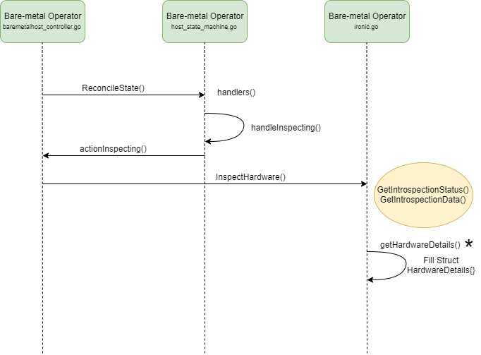

<!--
 This work is licensed under a Creative Commons Attribution 3.0
 Unported License.

 http://creativecommons.org/licenses/by/3.0/legalcode
-->

# Proposal to enhance Schema for Metal3

## Table of Contents

<!--ts-->
   * [Proposal to enhance Schema for Metal3](#title)
      * [Table of Contents](#table-of-contents)
      * [Summary](#summary)
      * [Motivation](#motivation)
         * [Goals](#goals)
      * [Proposal](#proposal)
         * [Implementation Details/Notes/Constraints](#implementation-detailsnotesconstraints)
         * [Risks and Mitigations](#risks-and-mitigations)
      * [Design Details](#design-details)
         * [Work Items](#work-items)
         * [Dependencies](#dependencies)
         * [Test Plan](#test-plan)
      * [References](#references)
<!--te-->

## Summary

Enhancing the `metal3` schema by adding useful parameters that we received 
from ironic introspection which will be helpful in performance based use cases.

## Motivation

To make the existing `metal3` schema compatible and scalable for heavy computation 
based use cases.  

### Goals

To compare the introspection data fetched from `Ironic-Inspector` through 
`Gopher-cloud client` library with `metal3` schema and add useful parameters 
in `metal3` schema.

## Proposal

The comparison of hardware introspection data coming from `Ironic-Inspector` 
and existing `metal3` schema for configuration of `baremetalhost` concludes 
that few hardware parameters are missing in `metal3` schema that are fetched 
from `Ironic-Inspector`. We propose to add these parameters in `metal3` schema for 
scalability and performance enhancement.

### Implementation Details/Notes/Constraints

Link for Existing `Metal3` Specs

Please refer `metal3` spec for bare-metal:
https://github.com/metal3-io/baremetal-operator/blob/master/deploy/crds/metal3.io_baremetalhosts_crd.yaml

The investigation of the existing schema indicates that BareMetal-Operator 
gets BareMetal node introspection data using an API call to `Ironic-Inspector` 
through `gopher-cloud client` library. 

Having fetched BareMetal Node introspection data from Ironic-Inspector and
compared it with BareMetalHost schema of `metal3` `(metal3.io_baremetalhosts_crd.yaml`), 
we recommend following parameters need to be added in schema of `metal3` for `NFV` 
workloads.
1. Add enhancement in the existing `metal3` schema for the following parameters:

    CPU Parameters:
    
    Parameters for `NUMA` topology:
     
    For better performance, selection of CPUs based on the `NUMA` topology 
    becomes necessary. In case of nodes with `DPDK` aware NICs, the CPUs for 
    poll mode driver (PMD) need to be selected from the `NUMA` node associated 
    with the `DPDK` NICs. If hyperthreading is enabled, then selection of the 
    logical cores requires the knowledge of the siblings.  

    Declarative design idea:
    ````yaml
    Cpu
     …
    numa_topology:
      properties:
        numa_node_0:
          properties:
            nics:
              properties:
                numa_node:
                  type: integer
                  description: Numa node id
                name:
                  type: string
                  description: network interface name
              type: object
            type: array
            ram:
              properties:
                numa_node:
                  type: integer
                  description: Numa node id
                size_kb:
                  type: string
                  description: memory in kb
              type: object
            type: array
            cpus:
              properties:
                cpu:
                  type: integer
                  description: cpu id 
                numa_node:
                  type: integer
                  description: Numa node id
                thread_siblings:
                  items:
                  type: integer
                type: array
                description: list of thread_siblings for each core
              type: object
            type: array
        …
      required:
      - nics
      - ram
      - cpu
      type: object
    ````
    
    Where,
    * `ram` a mapping from memory available to a `NUMA` node
    * `cpus` a mapping from physical CPU ID to a `NUMA` node and a list of sibling threads
    * `nics` a mapping from NIC names to `NUMA` node

    Boot Parameters:
    
    * current_boot_mode: `uefi`
        
        UEFI is installed when device is manufactured. It is the first program which runs when the device is turned on. UEFI replace BIOS.
    * pxe_interface: `ff:ff:ff:ff:ff:ff`
        
        The boot interface manages booting of both the deploy ramdisk and user interfaces on bare metal node. PXE boot interface is generic and works with all hardware that supports booting from network.
    
    Declarative design idea:
    ````yaml
    boot:
        properties:
            current_boot_mode:
                type: string
                description: current boot mode
            pxe_interface:
                type: string
                description: pxe boot interface supports booting from network
        type: object
        required:
        - current_boot_mode
        - pxe_interface
     ````
2. Enhance struct in `baremetalhost_types.go` to store values for additional proposed parameters.
    ````yaml
    type CPU struct {
    ...
        NumaTopology NumaTopology `json:"numaTopology"`
    }
    
    type NumaTopology struct {
        NNics NumaNICS `json:"nNics"`
        NRam  NumaRAM  `json:"nRam"`
        NCPU  NumaCPU  `json:"nCpu"`
    }
    type NumaNICS struct {
        NumaNodeId int    `json:"numaNodeID"`
        Name       string `json:"name"`
    }
    type NumaRAM struct {
        NumaNodeId int `json:"numaNodeID"`
        SizeKb     int `json:"sizeKb"`
    }
    type NumaCPU struct {
        NumaNodeId     int `json:"numaNodeID"`
        CpuId          int `json:"cpuID"`
        ThreadSiblings int `json:"threadSiblings"`
    }
    type Boot struct {
        CurrentBootMode string `json:"currentBootMode"`
        PxeInterface string `json:"pxeInterface"`
    }
    ````
3. Changes in ironic.go:

* To add support for parameters of `NUMA` topology we will update `getCPUDetails()` function.
* Add new function `getBootDetails()` which will get details like `CurrentBootMode` and `PxeInterface` 
and it will be called in `getHardwareDetails()` function.

### Risks and Mitigations

None

## Design Details



*The changes are illustrated  in Implementation Details section.

### Work Items

1. Introduce new section called `boot` under `hardware` in schema `metal3.io_baremetalhosts_crd.yaml`.
2. Update the existing sections for `cpu` which will include `NUMA` related parameters in schema.
3. Define structure for `boot` parameters in `baremetalhosts_types.go`.
4. Define structure for `NUMA` parameters and call it in `cpu` structure in `baremetalhost_types.go`.
5. Fetch `NUMA` details from `Ironic` and store it in structure. 
6. Fetch `boot` details from `Ironic` and update boot structure.
7. Write unit tests for above implementation.

### Dependencies

Ironic

### Test Plan
 
1. Unit test will be implemented.
2. Functional testing will be performed.
3. Deployment & integration testing will be done.

## References

* https://github.com/metal3-io
* https://github.com/metal3-io/baremetal-operator/blob/master/deploy/crds/metal3.io_baremetalhosts_crd.yaml
